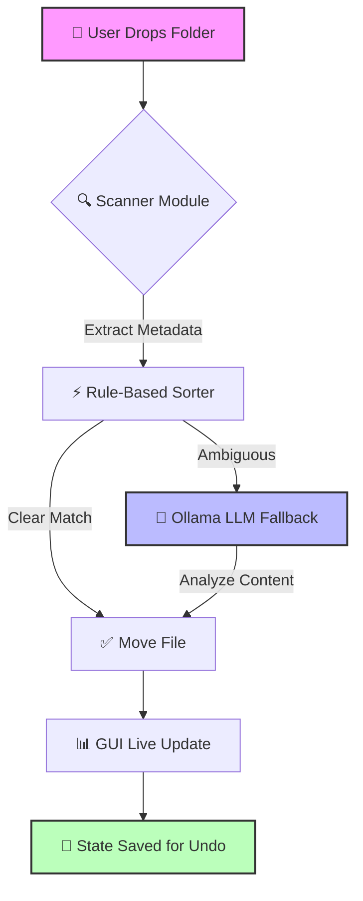

# 🚀 DesktopAI Organizer

<div align="center">

[](https://www.python.org/)
[](https://doc.qt.io/qtforpython/)
[](https://ollama.com/)
[](LICENSE)
[](CONTRIBUTING.md)

**100% Offline, Privacy-First AI File Organization for Your Desktop.**

[🚀 Quick Start](#-quick-start) • [📖 Documentation](docs/index.md) • [🛤️ Roadmap](ROADMAP.md) • [🤝 Contributing](CONTRIBUTING.md)

</div>

---

## 📑 Table of Contents

1. [✨ Key Features](#-key-features)
2. [🏗️ Architecture Overview](#️-architecture-overview)
3. [🚀 Quick Start](#-quick-start)
4. [⚙️ Configuration](#️-configuration)
5. [📂 Project Structure](#-project-structure)
6. [❓ FAQ & Troubleshooting](#-faq--troubleshooting)
7. [🛡️ Security & Privacy](#️-security--privacy)
8. [🤝 Community & Support](#-community--support)

---

## ✨ Key Features

- **🧠 Hybrid AI Categorization:** Instant rule-based sorting (milliseconds) + Local LLM fallback for ambiguous files (seconds).
- **🎨 Modern GUI:** Built with PySide6, featuring dark theme, drag-and-drop, live progress bars, and smart preview tables.
- **🔒 100% Offline & Private:** Your files and AI prompts never leave your machine. Zero cloud telemetry.
- **🛡️ Robust & Reliable:** Gracefully handles Windows file locks, corrupted files, and includes a 1-click **Undo Last** feature.

---

## 🏗️ Architecture Overview

DesktopAI uses a hybrid pipeline to balance speed and accuracy:



---

## 🚀 Quick Start

### Prerequisites

1. **Python 3.10+** installed.
2. **Ollama** installed and running (`ollama serve`).

### Installation (5 minutes)

```bash
# 1. Clone the repository
git clone https://github.com/gokul-prof-ai/Desktop-AI.git
cd Desktop-AI

# 2. Create and activate virtual environment
python -m venv .venv
# Windows:
.venv\Scripts\activate
# macOS/Linux:
source .venv/bin/activate

# 3. Install dependencies
pip install -r requirements.txt

# 4. Pull the recommended local AI model
ollama pull llama3.2:1b
```

### Usage

1. Launch the app: `python run.py`
2. Drag and drop a messy folder into the Drop Zone.
3. Click **🔍 Analyze Folder** to review AI suggestions.
4. Click **✅ Apply Organization** to execute the move.
5. Made a mistake? Click **↩️ Undo Last**.

---

## ⚙️ Configuration

Environment variables can be set to customize behavior (defaults shown):

| Variable                      | Default                  | Description                          |
| ----------------------------- | ------------------------ | ------------------------------------ |
| `DESKTOPAI_OLLAMA_MODEL`      | `llama3.2`               | Primary model for ambiguous files.   |
| `DESKTOPAI_OLLAMA_MODEL_FAST` | `llama3.2:1b`            | Fast model for quick categorization. |
| `DESKTOPAI_OLLAMA_HOST`       | `http://localhost:11434` | Local Ollama API endpoint.           |
| `DESKTOPAI_MAX_WORKERS`       | `4`                      | Concurrent file processing threads.  |

> [!TIP]
> Create a `.env` file in the root directory to persist these settings without modifying system environment variables.

---

## 📂 Project Structure

```text
Desktop-AI/
├── src/
│   ├── ai/               # Hybrid AI categorizer & Ollama integration
│   ├── core/             # Configuration, logging, and utilities
│   ├── documents/        # Parsers for PDF, DOCX, Excel, OCR
│   ├── gui/              # PySide6 Modern GUI components
│   ├── organizer/        # Auto-organizer pipeline & undo logic
│   └── scanner/          # Recursive file scanner & metadata extractor
├── docs/                 # Professional documentation
├── run.py                # Main application launcher
└── requirements.txt      # Python dependencies
```

---

## ❓ FAQ & Troubleshooting

<details>
<summary><b>⚠️ Ollama connection refused error?</b></summary>
Ensure Ollama is running in the background. Start it with <code>ollama serve</code> in a separate terminal.
</details>

<details>
<summary><b>⚠️ "Permission Denied" during file move?</b></summary>
The app handles Windows file locks gracefully, but ensure you have read/write permissions for the target directory. Run as Administrator if needed.
</details>

<details>
<summary><b>🐌 AI categorization is too slow?</b></summary>
Set <code>DESKTOPAI_OLLAMA_MODEL_FAST=llama3.2:1b</code> in your environment to prioritize speed over deep analysis.
</details>

---

## 🛡️ Security & Privacy

- **Zero Data Exfiltration:** All file scanning and LLM inference occur locally via Ollama.
- **No Telemetry:** The application does not collect usage statistics or crash reports.
- **Safe Execution:** File moves are staged and logged, enabling instant rollback via the Undo feature.

---

## 🤝 Community & Support

- 🐛 **Report Bugs:** [Open an Issue](https://github.com/gokul-prof-ai/Desktop-AI/issues)
- 💡 **Request Features:** [Discussions](https://github.com/gokul-prof-ai/Desktop-AI/discussions)
- 📖 **Full Documentation:** [docs/index.md](docs/index.md)

<div align="center">
  <sub>Built with ❤️ for privacy-conscious developers.</sub>
</div>
```
